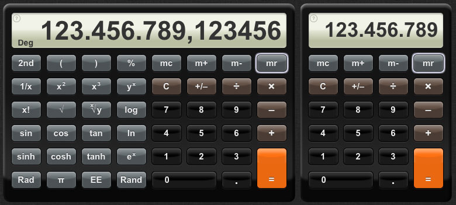

# Calculator - CalcSS3

This is a CSS3 remake of the well known iPhone™ calculator. (No images, only CSS). 
This scientific calculator works just like most other calculators of its kind and probably doesn't need any further explanations ;o). 
Find some more info/help by clicking the '?' in the left top corner of the calculator's screen or see: [Using the Calculator](http://dematte.at/calculator#usage).

##Demo
See **demo** at [dematte.at/CalcSS3/](http://www.dematte.at/CalcSS3/)

CalcSS3 used to be an exercise to learn 'new' features of CSS3 in 2010, but I could not resist making it work... so I did. It is not a best practice example, it is more like a review from back then, but it works quite good. Have fun! 
[Find CalcSS3 as a Chrome extension at the Google App Store](https://chrome.google.com/webstore/detail/iicfbobganffbpdodmdcbcpblomkbeoa)
